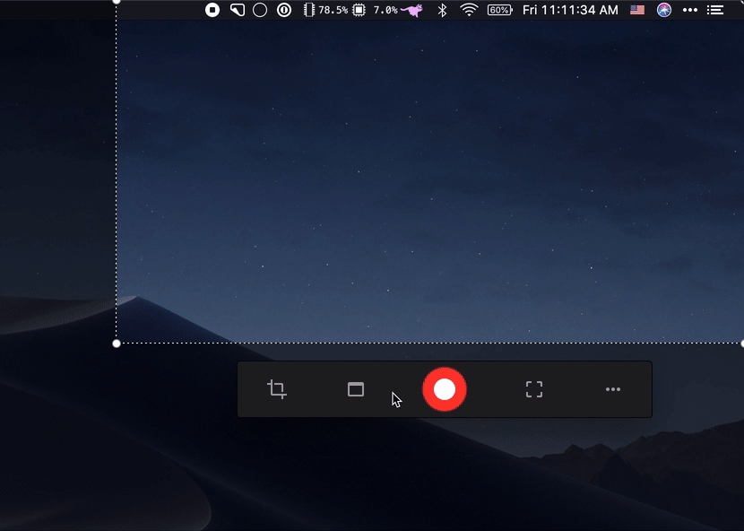

# kap-hide-clock 

> [Kap](https://github.com/wulkano/kap) plugin - Hide the menu bar clock or [Dato](https://sindresorhus.com/dato) while recording

This hides the menu bar date/time widget while recording, which can be useful:
1. When you don't want to show that you recorded something at 4 AM.
2. If you edit a lot and leave out parts, the time will jump, which can be distracting.

## Install

In the `Kap` menu, go to `Preferences…`, select the `Plugins` pane, find this plugin, and toggle it.

## Usage

In the cropper or by right-clicking the tray icon, click the `…` icon, then `Plugins` and make sure `Hide Clock` is enabled.

## Demo

## Integration

If you would like your date/time app to integrate with this, you can subscribe to the following notifications posted by the plugin:

- `com.wulkano.kap.hideclock.willStartRecording`
- `com.wulkano.kap.hideclock.didStopRecording`

Subscribe with either [`DistributedNotificationCenter`](https://developer.apple.com/documentation/foundation/distributednotificationcenter) (Native) or [`systemPreferences.subscribeNotification`](https://www.electronjs.org/docs/api/system-preferences#systempreferencessubscribenotificationevent-callback-macos) (Electron).
